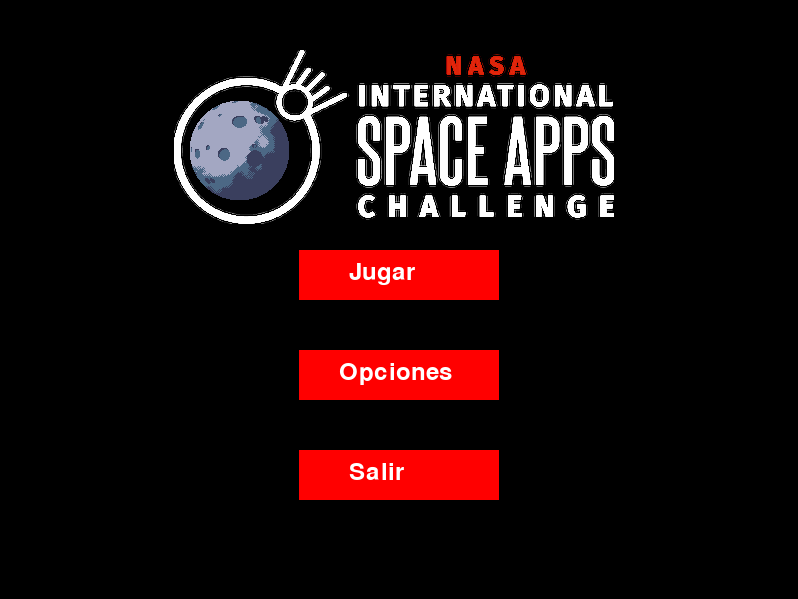
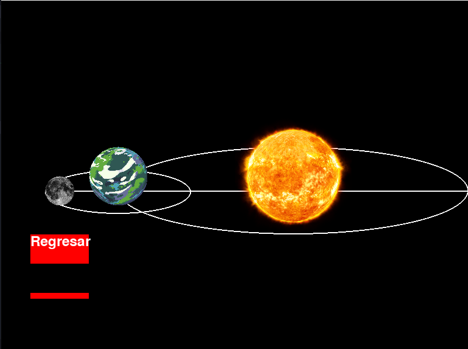
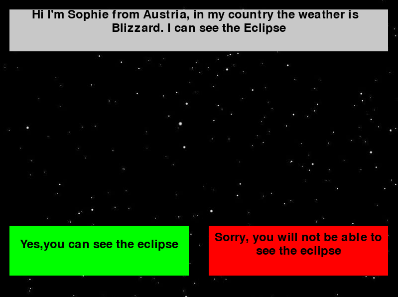
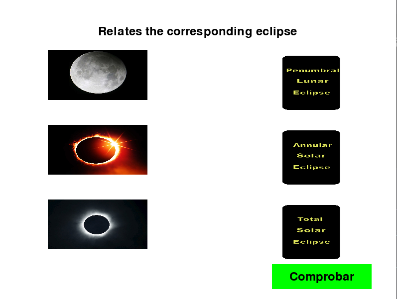
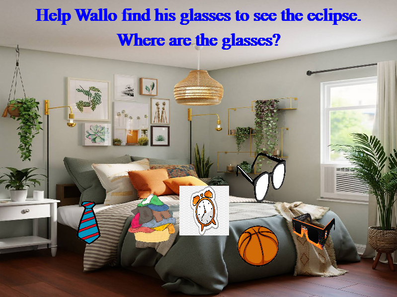
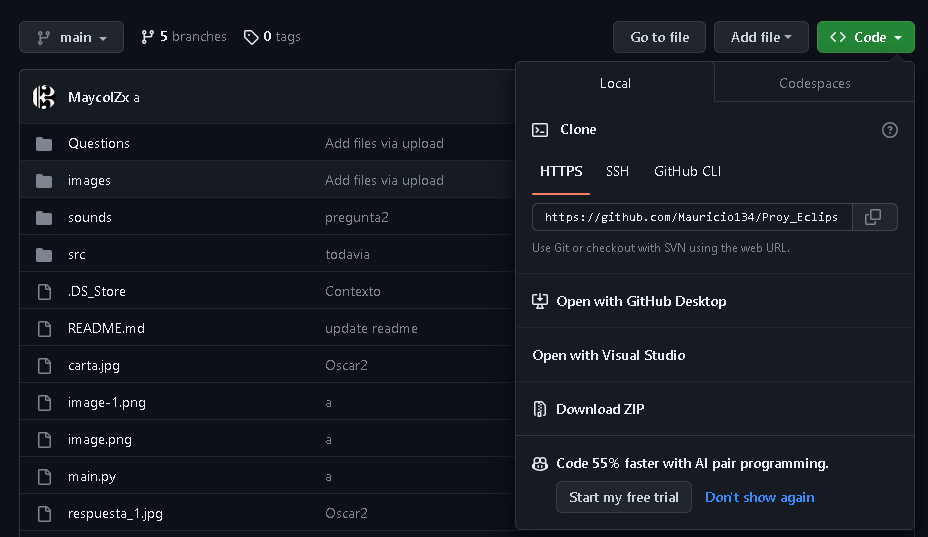
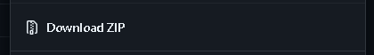

# Proy_Eclipse
Bueno ...



- POSITION ECLIPSE



- QUIZ



- DATE-QUIZ


- MATCH



- LOOK FOR THE GLASSES



## How to run the game

If you want to see the game code and how it runs and works, you will have to clone the repository with the following command.

- NOTE: It is important to know that if you want to do this you have git-bash or that at least your terminal has git to clone the repository.

```bash
    git clone https://github.com/Mauricio134/Proy_Eclipse.git
```

If you don't have git, you can download it through a zip, just remember that you have to unzip it for both the code and the game executable.



Click on download ZIP



unzip and run the code that is main.py

- NOTE: If we want to run the 'main.py' file we have to have python installed on our pc https://www.python.org/downloads/

